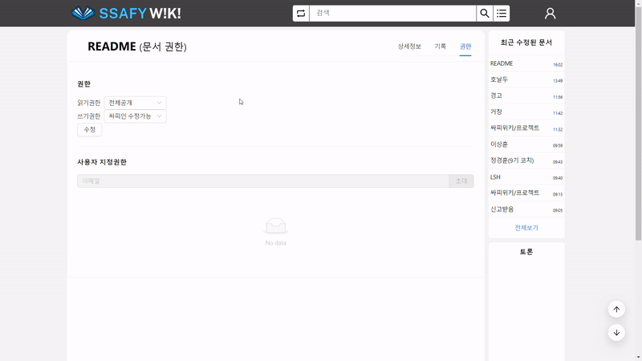

# 프로젝트 소개

🏷️ **프로젝트 명 :** 싸피위키(SSAFY-WIKI)

🗓️ **프로젝트 기간 :** 2023.10.09 ~ 2023.11.17 (6주)

👥 **구성원 :** 김광표(팀장), 권선근, 김승연, 조현덕, 최영은

# 🧐 기획배경

- “SSAFY 정보는 대외비야. 어디에서도 팁을 얻을 수 없어!”
- “이제 막 싸피에 들어와서 어떤 곳인지 너무 궁금해! 2학기는 뭘 하는 곳일까?”
- “우리 프로젝트의 위키를 작성하고 자랑하고 싶은데 적당한 플랫폼이 없을까? 이전 기수에서는 어떤 프로젝트를 진행했을까?”
- “팀 빌딩을 해야하는데, 이 팀원 어떤 기술스택을 가졌을까?”
- “새로운 캠퍼스에 왔는데 이 친구들은 어떤 성격일까?”

SSAFY인들이라면 이러한 고민을 한번 쯤은 해보았을 것입니다.

지금 현재 SSAFY 11기를 모집 중이지만, 1기부터 10기까지의 싸피 정보가 휘발되어서 찾기 어렵다는것에 안타깝게 생각하였습니다.

저희는 이러한 문제점을 덜기 위하여 싸피만을 위한 ‘디지털 정원’을 기획하고 개발하였습니다.

# 서비스 대상

- SSAFY 입과를 준비하는 예비 SSAFY인
- 이제 막 SSAFY에 들어온 병아리 SSAFY인
- 프로젝트를 진행하고 있는 SSAFY인
- 위와 같은 생각을 한 번쯤 고민해본 사람들

# 개요

싸피위키는 싸피 외부로는 싸피를 소개하고, 내부로는 정보를 축적하는 커뮤니티 입니다.

SSAFY-WIKI에서는 많은 SSAFY인들이 자신이 겪었던 SSAFY 생활들, 진행했던 프로젝트들을 꾸미고 공유할 수 있는 공간입니다. 이 공간에서 모든 SSAFY인들이 정보를 공유하며 소중한 자원들을 축적해나갈 수 있습니다.

# 💠주요기능

### 1️⃣ 문서 작성하기 📄

마크다운 + 자체문법을 이용하여 편리하게 작성할 수 있습니다.

이미지 업로드, GPT를 이용한 문서 첨삭도 가능합니다.

### 2️⃣ 문서 검색하기

우측 상단의 검색탭을 이용하여 검색어를 입력하고, 문서를 검색할 수 있습니다.

### 3️⃣ 문서 버전 관리 🔧

문서별로 버전을 확인하고 버전 별로 무엇이 달라졌는지 비교할 수 있어요. 

### 4️⃣ 문서 권한 관리

전체, 싸피인, 관리자, 프라이빗 권한을 두어 문서의 읽기, 쓰기 권한을 설정할 수 있습니다.

### 5️⃣ SSAFY인들과 소통하기 👯

문서 페이지마다 존재하는 토론을 통해 실시간으로 문서에 대한 이야기를 나눌 수 있어요!

## 추가기능

- 신고기능
- 랜덤문서
- 스트릭

# 서비스 화면

### 메인페이지

### 문서작성

### 충돌 관리

### 검색

### 권한관리

### 최근 수정된 문서

### 토론

### 신고

### 랜덤문서

### 이메일 인증

### 스트릭

# ⚒ 기술스택

### Frontend

VS Code, React

### Backend

Intellij, Java(17), SpringBoot(3.1), Gradle, ORM (JPA), Spring Security, java-jwt, Swagger

### Communication

노션,메타모스트,지라,깃랩

# 🗒️ERD

# API 명세서

