# 프로젝트 소개

🏷️ **프로젝트 명 :** 싸피위키(SSAFY-WIKI)

🗓️ **프로젝트 기간 :** 2023.10.09 ~ 2023.11.17 (6주)

👥 **구성원 :** 김광표(팀장), 권선근, 김승연, 조현덕, 최영은

# 🧐 기획배경

- “SSAFY 정보는 대외비야. 어디에서도 팁을 얻을 수 없어!”
- “이제 막 싸피에 들어와서 어떤 곳인지 너무 궁금해! 2학기는 뭘 하는 곳일까?”
- “우리 프로젝트의 위키를 작성하고 자랑하고 싶은데 적당한 플랫폼이 없을까? 이전 기수에서는 어떤 프로젝트를 진행했을까?”
- “팀 빌딩을 해야하는데, 이 팀원 어떤 기술스택을 가졌을까?”
- “새로운 캠퍼스에 왔는데 이 친구들은 어떤 성격일까?”

SSAFY인들이라면 이러한 고민을 한번 쯤은 해보았을 것입니다.

지금 현재 SSAFY 11기를 모집 중이지만, 1기부터 10기까지의 싸피 정보가 휘발되어서 찾기 어렵다는것에 안타깝게 생각하였습니다.

저희는 이러한 문제점을 덜기 위하여 싸피만을 위한 ‘디지털 정원’을 기획하고 개발하였습니다.

# 서비스 대상

- SSAFY 입과를 준비하는 예비 SSAFY인
- 이제 막 SSAFY에 들어온 병아리 SSAFY인
- 프로젝트를 진행하고 있는 SSAFY인
- 위와 같은 생각을 한 번쯤 고민해본 사람들

# 개요

싸피위키는 싸피 외부로는 싸피를 소개하고, 내부로는 정보를 축적하는 커뮤니티 입니다.

SSAFY-WIKI에서는 많은 SSAFY인들이 자신이 겪었던 SSAFY 생활들, 진행했던 프로젝트들을 꾸미고 공유할 수 있는 공간입니다. 이 공간에서 모든 SSAFY인들이 정보를 공유하며 소중한 자원들을 축적해나갈 수 있습니다.

# 💠주요기능

### 1️⃣ 문서 작성하기 📄

마크다운 + 자체문법을 이용하여 편리하게 작성할 수 있습니다.

이미지 업로드, GPT를 이용한 문서 첨삭도 가능합니다.

### 2️⃣ 문서 검색하기

우측 상단의 검색탭을 이용하여 검색어를 입력하고, 문서를 검색할 수 있습니다.

### 3️⃣ 문서 버전 관리 🔧

문서별로 버전을 확인하고 버전 별로 무엇이 달라졌는지 비교할 수 있습니다. 

### 4️⃣ 문서 권한 관리

전체, 싸피인, 관리자, 프라이빗 권한을 두어 문서의 읽기, 쓰기 권한을 설정할 수 있습니다.

### 5️⃣ SSAFY인들과 소통하기 👯

문서 페이지마다 존재하는 토론을 통해 실시간으로 문서에 대한 이야기를 나눌 수 있습니다.

## 추가기능

- 신고기능
- 랜덤문서
- 스트릭

# 서비스 화면

### 메인페이지
SSAFY-WIKI의 메인 페이지는 대문 문서로 들어가게 됩니다.
대문에서는 SSAFY-WIKI의 역사, 주요 기능, 최근 업데이터된 기능 소개와 사용법을 알려줍니다. 또한 우측 탭의 최근 수정된 문서를 확인하고 토론 창을 통해 소통할 수 있습니다.

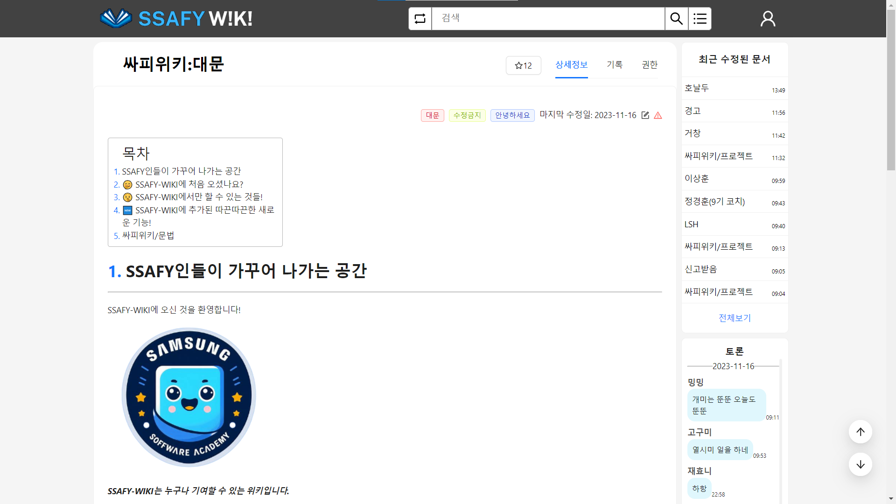{: width="1000"}

### 문서작성
기존에 없는 문서에 대해 검색하면 문서 생성 페이지로 이동합니다. 문서의 대분류를 선택하여 권한 처리를 수행하고 대외비 문서를 관리합니다. 내가 만든 템플릿과 다른 사람이 만든 템플릿을 확인하고 선택할 수 있습니다.

문서 작성 창에서는 마크다운 기반의 문법과 SSAFY-WIKI만의 자체 문법을 통해 자유롭게 문서를 작성할 수 있습니다.

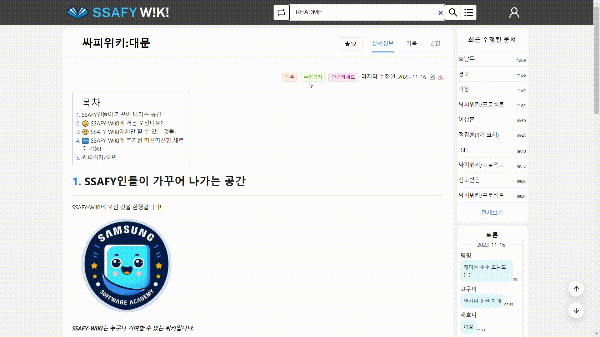{: width="1000"}

문서 내용을 작성한 후 아래에 있는 GPT 프롬프트를 이용하여 첨삭을 받을 수 있습니다.

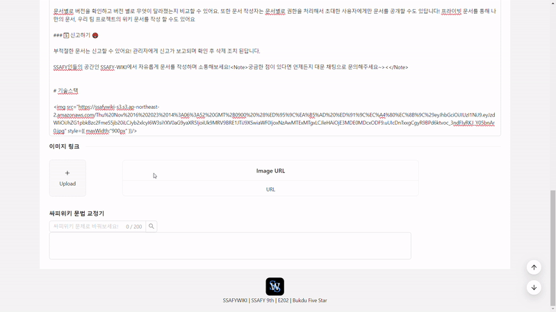{: width="1000"}

문서 작성 후 문서의 내용을 확인한 후에 등록이 가능합니다.

{: width="1000"}

### 충돌 관리
문서 수정 중 다른 사람이 먼저 해당 문서를 수정했을 경우에 충돌이 발생합니다. HEAD, PATCH로 나타나며 해당 충돌을 반드시 해결해야 문서 저장이 가능합니다.

{: width="1000"}

### 검색
Elasticsearch를 활용한 자동완성 검색 기능을 제공합니다.
검색창 우측의 왼쪽 버튼은 검색어에 정확하게 해당하는 문서를 검색하고, 문서가 있으면 문서 상세 페이지로 이동합니다. 문서가 없으면 검색어와 가장 유사한 문서 리스트를 보여줍니다.
검색창 우측의 오른쪽 버튼은 검색어와 유사한 문서에 대한 리스트 페이지로 이동합니다.

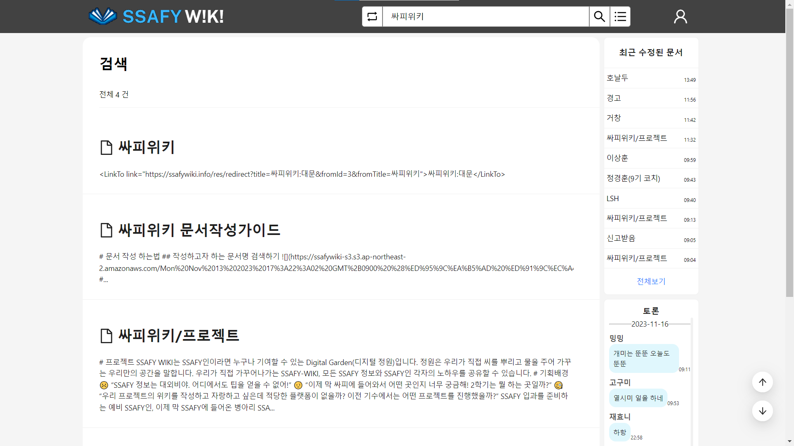{: width="1000"}

### 권한관리
본인이 작성한 문서의 권한 탭에서 전체 공개, 싸피인 공개, 관리자 공개, 사용자 지정 권한으로 권한을 설정할 수 있습니다.
사용자 지정 권한의 경우 아래에서 사용자의 이메일을 등록함으로써 초대가 가능합니다.

{: width="1000"}

읽기 권한이 없는 문서로 들어가면 문서를 읽을 수 없다는 알림 창이 뜹니다.

{: width="1000"}

쓰기 권한이 없는 문서의 수정 페이지로 들어가면 문서를 수정할 수 없다는 알림 창이 뜹니다.

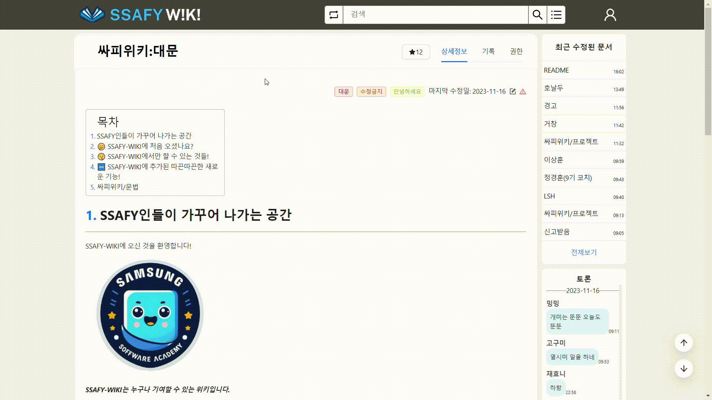{: width="1000"}

### 최근 수정된 문서
모든 페이지 우측 상단에는 최근 수정된 문서 정보가 실시간으로 업데이트 됩니다.

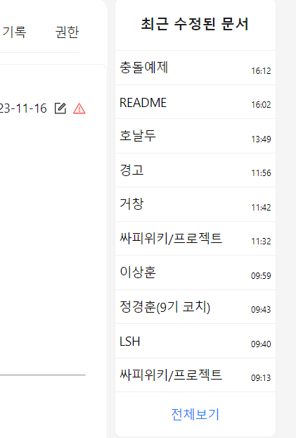{: width="500"}

### 토론
모든 문서 페이지에는 문서 페이지에 대해 토론할 수 있는 공간이 존재합니다.

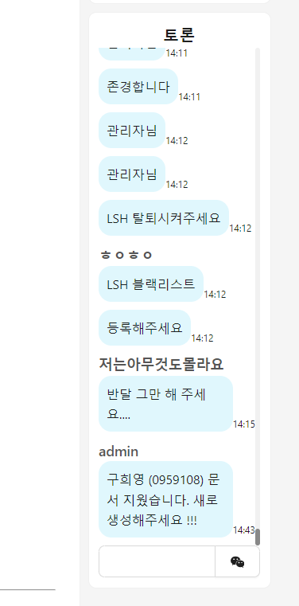{: width="500"}

### 신고
{: width="1000"}

### 랜덤문서
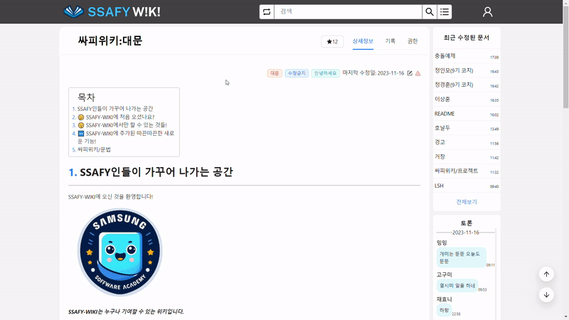{: width="1000"}

### 이메일 인증
대외비 문서 관리를 위해 SSAFY인들만 회원가입 할 수 있도록 제한하였습니다. SSAFY 이메일 외에는 회원가입이 불가능합니다.

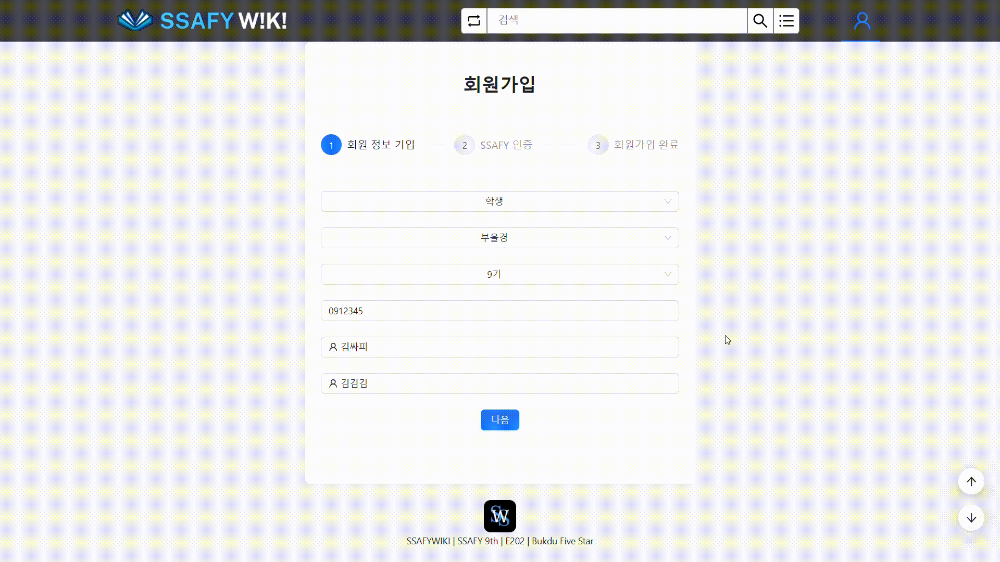{: width="1000"}

### 스트릭
마이페이지를 통해 본인이 기여한 문서에 대한 커밋 기록을 볼 수 있습니다.

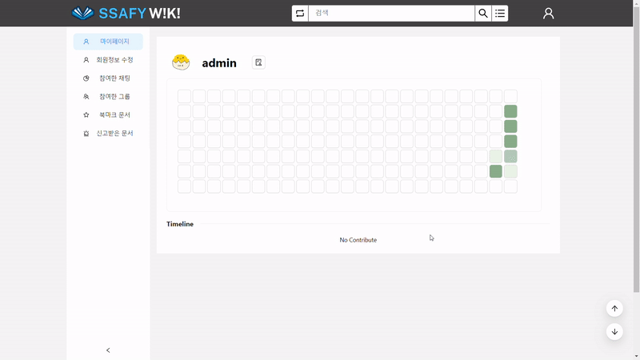{: width="1000"}

# ⚒ 개발 환경

### ⚙ Management Tool
- 형상 관리 : Gitlab
- 이슈 관리 : Jira
- 커뮤니케이션 : Mattermost, Webex, Notion, Discord
- 디자인 : Figma, PowerPoint

## 💻 IDE

- Visual Studio Code `1.18.1`
- IntelliJ `11.0.19`

### Frontend

### Backend

# 설계 문서
## 🗒️ERD

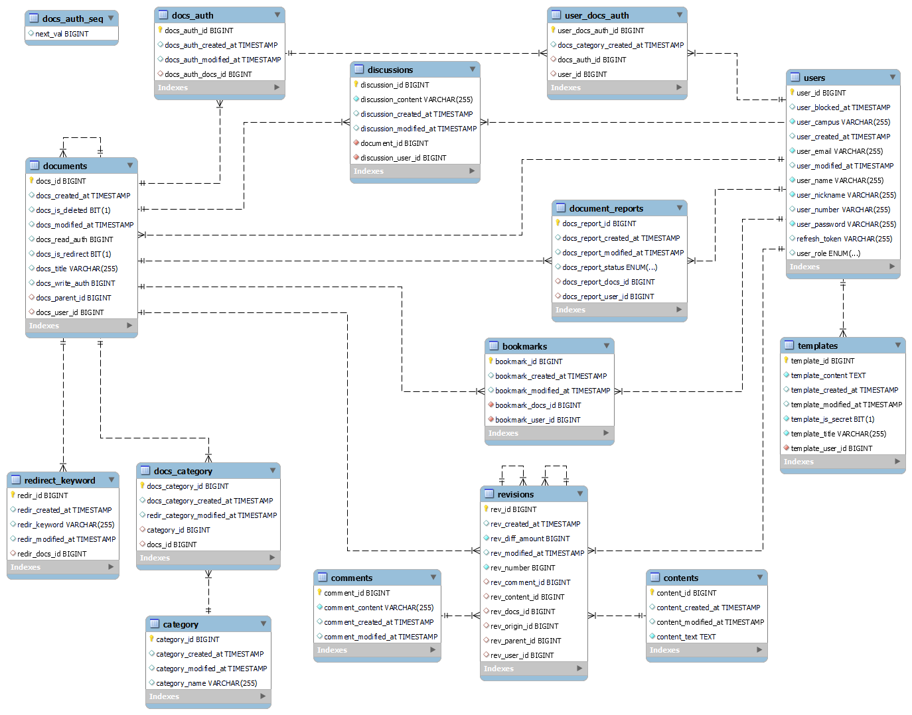

## 요구사항 명세서

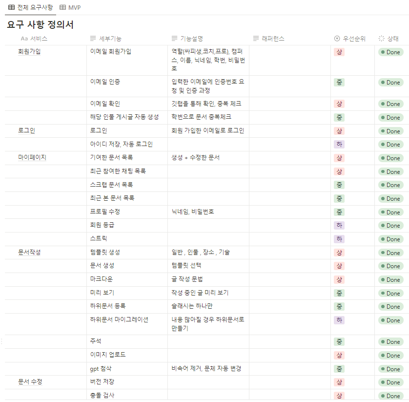
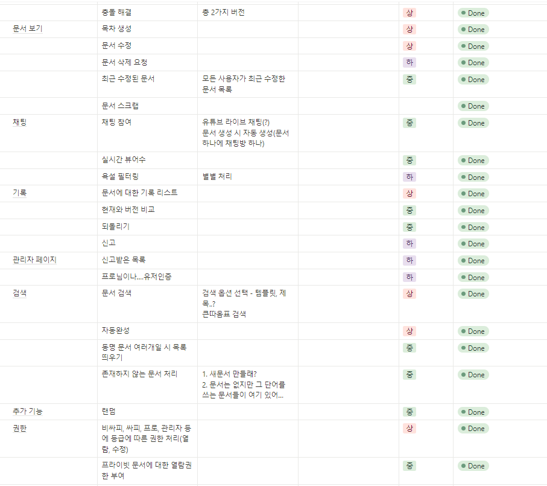

## API 명세서

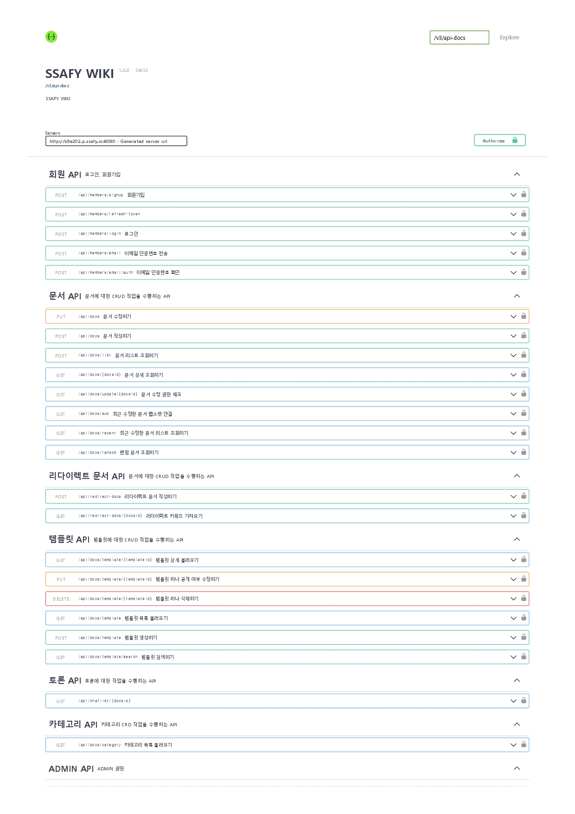

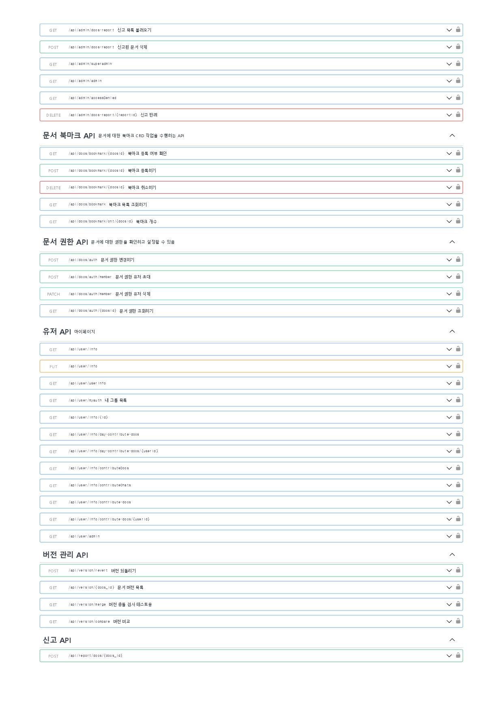

## 협업 : Notion
|노션을 활용한 협업 진행|멤버 정보|
|---|---|
|||
|개인 일정을 공유하고 프로젝트 일정을 맞춰나갔습니다.|팀원 정보입니다.|

|기술 스택 학습 및 공유|주간 회고록 작성|
|---|---|
|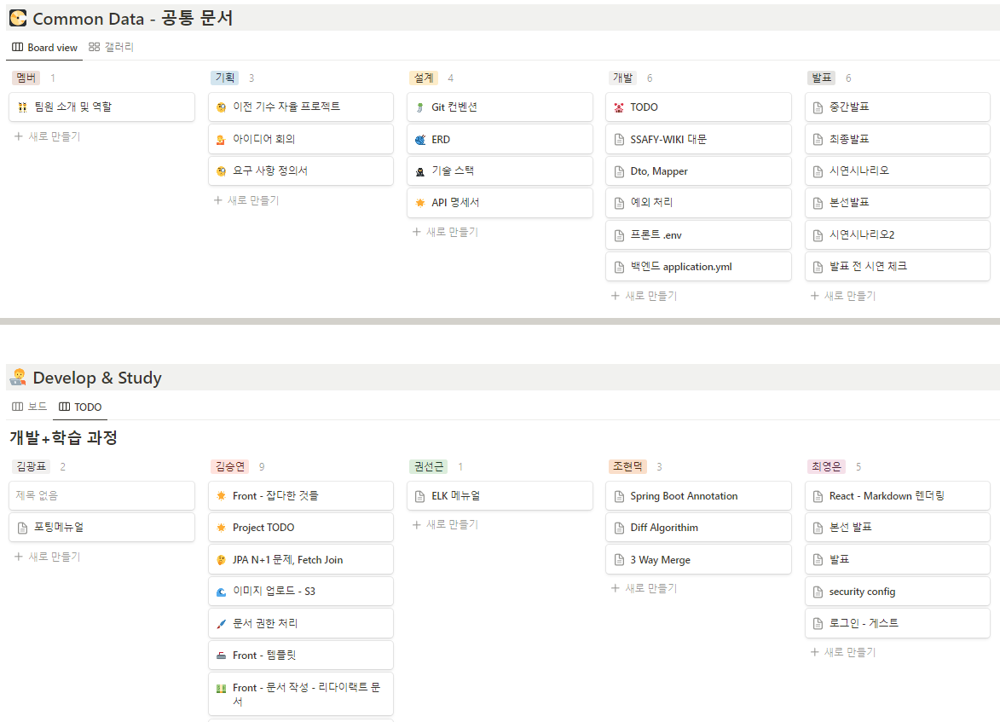||
|프로젝트에서 사용하는 기술 스택을 학습하고 노선을 활용하여 정보를 공유하였습니다.|매 주마다 개인별, 팀별 회고록을 작성하며 주차별로 발전해나가는 기록을 남길 수 있었습니다.|

|JIRA를 활용한 일정관리|Git convention & 일관된 커밋 메시지|
|---|---|
|||
|JIRA를 활용하여 매주 목표를 정하고 스프린트를 작성하여 프로젝트 전체 일정을 관리하였습니다.|Git 브랜치 전략과 commit convention을 정하고, 해당 컨벤션을 바탕으로 일관된 커밋 메시지를 작성했습니다.|

# 😎 팀원 소개와 역할 분담

|**[김광표](https://github.com/Pangpyo)**|**[권선근](https://github.com/kss4037)**|**[김승연](https://github.com/ksy00826)**|**[조현덕](https://github.com/gusejr4547)**|**[최영은](https://github.com/YoungEun-Choi930)**|
|:--------------------------------------------------------------------------------------------------:|:--------------------------------------------------------------------------------------------------:|:--------------------------------------------------------------------------------------------------:|:--------------------------------------------------------------------------------------------------:|:--------------------------------------------------------------------------------------------------:|
||||||
|Fullstack|Fullstack|Fullstack|Fullstack|Fullstack|
|팀장|UCC|서기|부팀장|발표|

